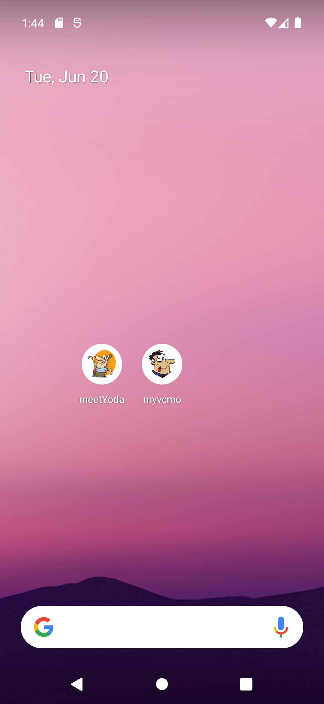
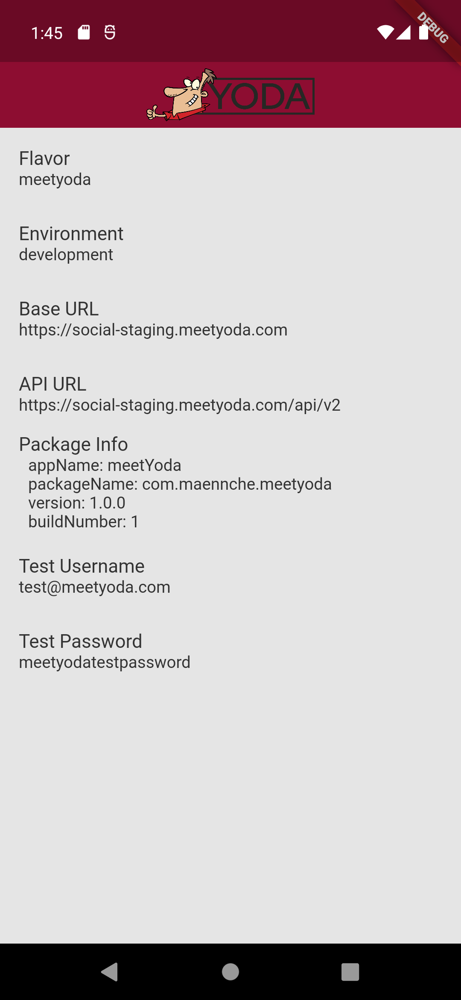
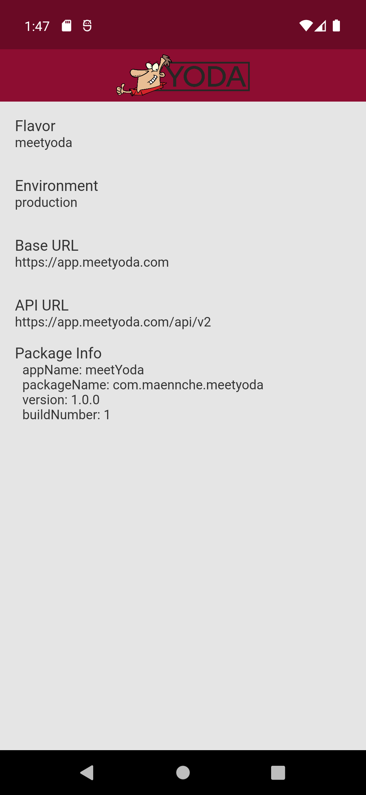
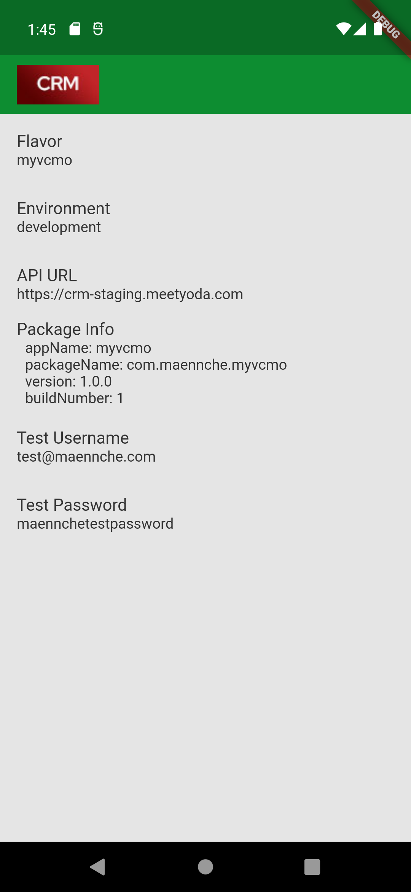
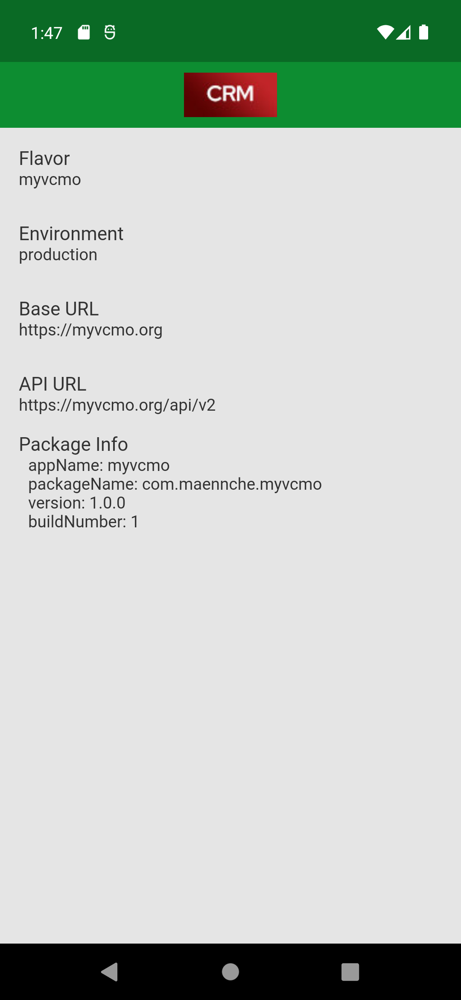

# flutter_flavor_concept

Utilizing Flutter flavor feature combined with environmental variables to create two slightly different apps with a single codebase.
***

## Getting Started

**Step 1:**

Download or clone this repo by using the command below:

```bash
git clone https://github.com/azeunkn0wn/flutter_flavor_concept.git
```

**Step 2:**

Go to project root and execute the following command in console to get the required dependencies:

```bash
flutter pub get 
```

**Step 3:**

Create environment directory and `.env` files.

- env
  - meetyoda
    - .env.development
    - .env.production
  - myvcmo
    - .env.development
    - .env.production

Refer to the `.env.example` for the content of each `.env` files.
***

## Run app with Android

### **Meetyoda debug mode**

```bash
flutter run --flavor meetyoda -t lib/main_meetyoda.dart
```

### **MeetYoda release mode**

```bash
flutter run --release --flavor meetyoda -t lib/main_meetyoda.dart
```

### **myvcmo debug mode**

```bash
flutter run --flavor myvcmo -t lib/main_meetyoda.dart
```

### **myvcmo release mode**

```bash
flutter run --release --flavor myvcmo -t lib/main_meetyoda.dart
```

***

## Screenshots

<div style="height: 20px;"></div>

### App Launcher Icon



<div style="height: 20px;"></div>

### MeetYoda debug mode



<div style="height: 20px;"></div>

### MeetYoda release mode



<div style="height: 20px;"></div>

### myvcmo debug mode



<div style="height: 20px;"></div>

### myvcmo release mode


